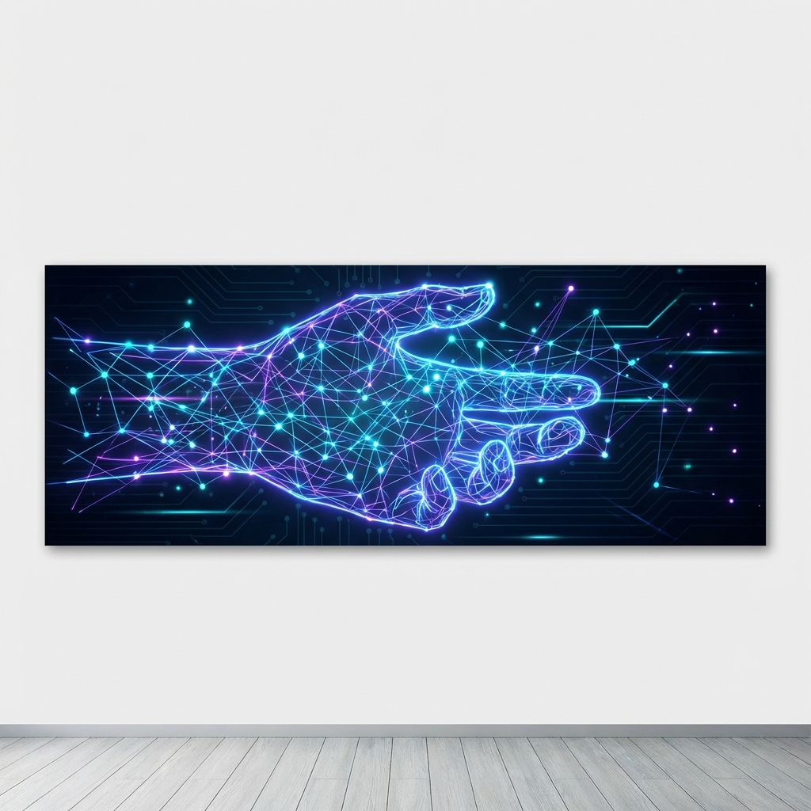
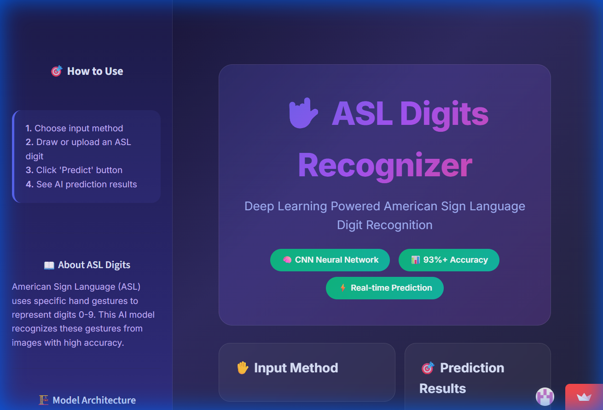

# 🤟 ASL Digits Recognizer 🤟

[](https://git.io/typing-svg)

<div align="center">


[](https://asl-digit-recognition-cnn-opencv-project.streamlit.app/)
[](https://github.com/mayank-goyal09)
[](https://www.linkedin.com/in/mayank-goyal-mg09/)



### 🤲 **Real-time translation of American Sign Language digits into text using Deep Learning** 🧠

</div>

---

## 🌟 **WHAT IS THIS?** 🌟

<table>
<tr>
<td width="50%">

### 🎯 **The Mission**

This project bridges the communication gap by translating **American Sign Language (ASL) digits (0-9)** into text instantly.

We trained a custom **Convolutional Neural Network (CNN)** on the Kaggle Sign Language Digits Dataset, achieving **~96% test accuracy**. The model is deployed via a **Streamlit web (image/canvas)** and an **OpenCV desktop app (real-time webcam)**, demonstrating the power of computer vision in meaningful applications.

**Think of it as:**
- 👁️ **Eyes** = OpenCV / Canvas Input
- 🧠 **Brain** = 3-Layer CNN Model
- 🗣️ **Output** = Instant Digit Prediction

</td>
<td width="50%">

### 🔥 **Key Features**

✅ **Custom CNN Architecture**: 3 Conv2D-MaxP blocks + Dense layers.
✅ **High Accuracy**: Achieved ~96% on test set.
✅ **Robust Input Handling**: Reshaped to `(64,64,1)` & normalized.
✅ **Smart "Uncertainty" Logic**: Alerts users when confidence is low.
✅ **Dual Deployment**:
   - 🌐 **Web**: Streamlit with upload/draw support.
   - 🖥️ **Desktop**: OpenCV Webcam with ROI cropping.
✅ **Visualizaions**: Feature maps showing edge detection.

</td>
</tr>
</table>

---

## 📸 **LIVE PREVIEW** 📸

<div align="center">
  <a href="https://asl-digit-recognition-cnn-opencv-project.streamlit.app/">
    
  </a>
  <p><em>Click the image above to launch the interactive web app!</em></p>
</div>

---

## 🛠️ **TECH STACK** 🛠️


| **Category** | **Technologies** |
|--------------|------------------|
| 🐍 **Language** | Python 3.9+ |
| 🧠 **Deep Learning** | TensorFlow, Keras |
| 👁️ **Computer Vision** | OpenCV (cv2) |
| 📊 **Data Processing** | NumPy, Pandas |
| 🎨 **Frontend** | Streamlit, Streamlit-Drawable-Canvas |
| 📈 **Visualization** | Matplotlib, Seaborn |

---

## 📂 **PROJECT STRUCTURE** 📂

```bash
ASL-Digits-Recognizer/
│
├── 📁 assets/                     # Images, banners, and screenshots
├── 📁 models/                     # Saved .keras models
├── 📄 app.py                      # Streamlit Web Application
├── 📄 main.ipynb                  # Training Notebook (EDA, CNN, Eval)
├── 📄 requirements.txt            # Python Dependencies
├── 📄 X.npy / Y.npy               # Kaggle Dataset Files
└── 📖 README.md                   # Project Documentation
```

---

## 🧪 **HOW IT WORKS** 🧪

### **1. 🧠 Model Architecture & Training**

We built a robust **Convolutional Neural Network (CNN)** optimized for image classification:

*   **Data Source**: Loaded **Kaggle Sign Language Digits Dataset** from `X.npy` (images) and `Y.npy` (one-hot labels).
*   **Preprocessing**:
    *   **Reshape**: Converted inputs to `(64, 64, 1)` (Grayscale).
    *   **Normalization**: Scaled pixel values to `[0, 1]`.
*   **Architecture**:
    *   **3x Conv2D Blocks**: Each with `ReLU` activation and `MaxPooling2D` for feature extraction.
    *   **Dense Layers**: Fully connected layers for classification.
    *   **Output**: `Softmax` activation for 10-class probability distribution.
*   **Training**: Optimized using **Categorical Cross-entropy** loss.
*   **Results**: Achieved **~96% Test Accuracy**.

### **2. 👁️ Visualization & Evaluation**

<div align="center">
  
  <p><em>CNNs detect patterns like edges and curves layer by layer.</em></p>
</div>

*   **Confusion Matrix**: Validated that the model correctly distinguishes between similar gestures.
*   **Feature Maps**: Visualized intermediate layers to confirm the network learns hand shapes and edges, not just background noise.

### **3. 🚀 Deployment Logic**

#### A. **Streamlit Web App** (`app.py`)
*   Allows Image Upload, Canvas Drawing, or Sample Selection.
*   Applies the same `(64,64,1)` preprocessing pipeline.

#### B. **OpenCV Webcam App**
*   **ROI Cropping**: Captures a specific Region of Interest from the video feed.
*   **Real-time Preprocessing**: Converts ROI to grayscale -> Resizes to 64x64 -> Normalizes.
*   **Inference**:
    *   Displays **Top Prediction** and **Alternative Guesses**.
    *   **Safety Feature**: Displays an **"Uncertain"** message if model confidence is below threshold, prompting the user to adjust their hand.

---

## 🚀 **QUICK START** 🚀

### **Step 1: Clone the Repository** 📥
```bash
git clone https://github.com/mayank-goyal09/asl-digits-recognizer.git
cd asl-digits-recognizer
```

### **Step 2: Install Dependencies** 📦
```bash
pip install -r requirements.txt
```

### **Step 3: Run the Application** 🎯

**For the Web App:**
```bash
streamlit run app.py
```

**For the Webcam App:**
_(Ensure you have a webcam connected)_
```bash
# Run the opencv script (if available in your repo, e.g., webcam.py)
python webcam.py
```

---

## 📚 **SKILLS DEMONSTRATED** 📚

- ✅ **Deep Learning**: Designed and trained a custom CNN from scratch.
- ✅ **Computer Vision**: Implemented real-time image processing with OpenCV.
- ✅ **Data Science**: Handled .npy files, normalization, and one-hot encoding.
- ✅ **Model Evaluation**: Confusion matrices, accuracy metrics, and feature map audits.
- ✅ **Full-Stack ML**: Deployed model to a user-friendly frontend (Streamlit).
- ✅ **UX/UI Design**: Created a premium, responsive interface.

---

## 👨‍💻 **CONNECT WITH ME** 👨‍💻

[](https://github.com/mayank-goyal09)
[](https://www.linkedin.com/in/mayank-goyal-mg09/)

**Mayank Goyal**
🤖 AI & Deep Learning Enthusiast | 🐍 Python Developer

---

<div align="center">
  
  <p>Built with ❤️ using <strong>TensorFlow</strong> & <strong>Streamlit</strong></p>
</div>
